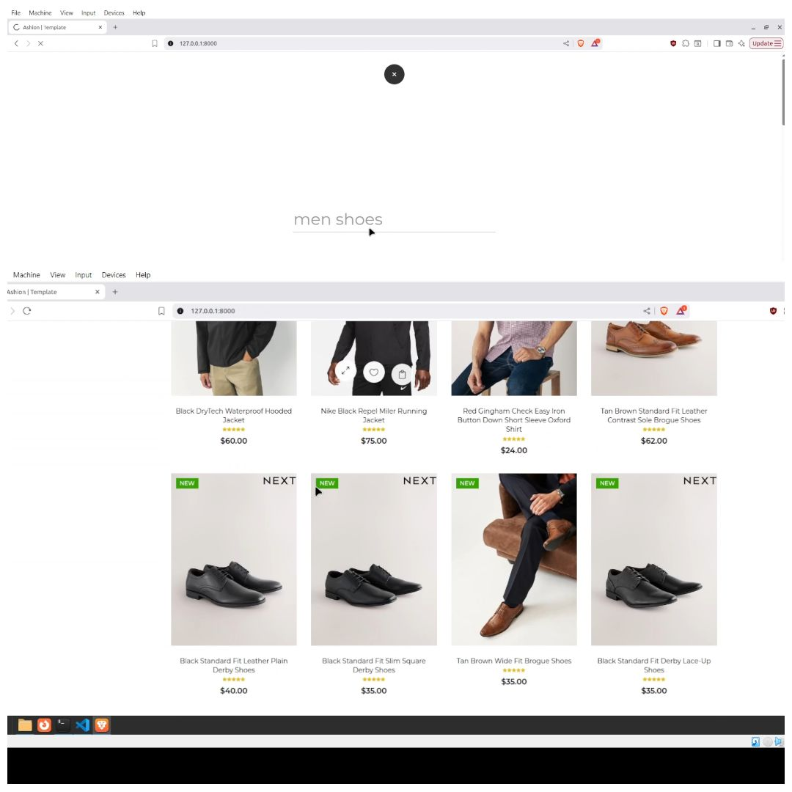
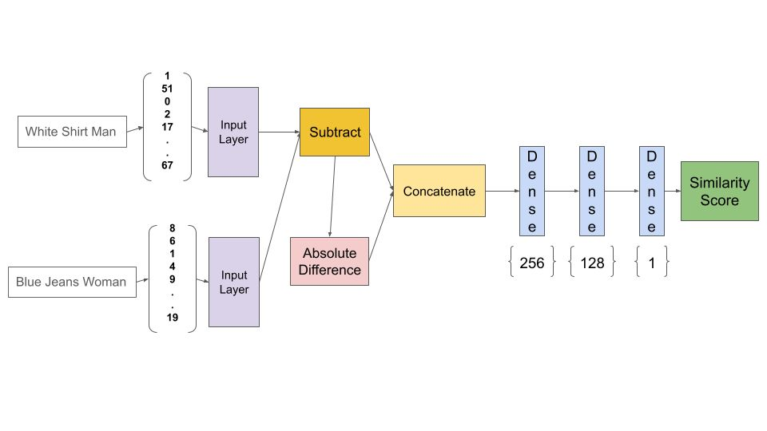

# Necessary Files
    - The pretrained folder contains recom4.h5 which is used to provide recommendation
    - It also contains gen_model.py which contains the necessary code to design and train the model

# Workflow
User makes a search query -> It hits an api ('search/') -> The string is sent to the model ->
model generates a recommendation and user sees it on the frontend.

# Snapshots

